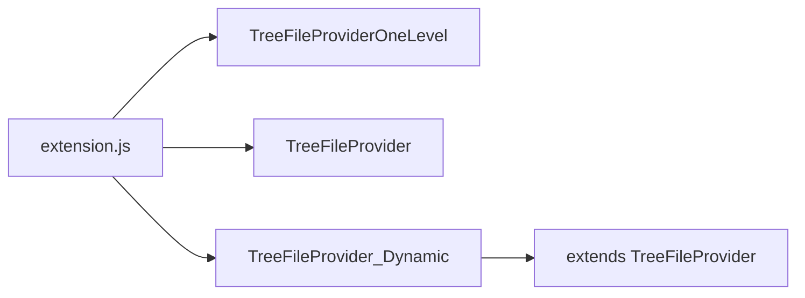

# Dynamic file tree — class riêng `TreeFileProvider_Dynamic.js`

## Mục tiêu

- Thêm `fbo-autocomplete.fileTreeLayout`: giá trị **`dynamic`**.
- Thêm option số nguyên (ví dụ **`fbo-autocomplete.fileTreeDynamicMinFiles`**, mặc định **`5`**, tối thiểu **`1`**): từ số file **≥ ngưỡng** trong **một group** thì build **multi-level** (giống [TreeFileProvider.js](e:/Customize Extension/fbo-autocomplete/src/TreeFile/TreeFileProvider.js)); **< ngưỡng** thì **một cấp** dưới group (giống hành vi danh sách phẳng [TreeFileProviderOneLevel.js](e:/Customize Extension/fbo-autocomplete/src/TreeFile/TreeFileProviderOneLevel.js)).
- **Toàn bộ logic “dynamic”** nằm trong [TreeFileProvider_Dynamic.js](e:/Customize Extension/fbo-autocomplete/src/TreeFile/TreeFileProvider_Dynamic.js) (file người dùng đã tạo); **không** nhét nhánh `dynamic` rải rác trong `TreeFileProvider.js`.

## Kiến trúc

- [extension.js](e:/Customize Extension/fbo-autocomplete/src/extension.js): chọn constructor theo `fileTreeLayout`:
  - `oneLevel` → `TreeFileProviderOneLevel`
  - `nested` → `TreeFileProvider`
  - `dynamic` → `TreeFileProvider_Dynamic` (class mới, `require('./TreeFile/TreeFileProvider_Dynamic')`)

## Nội dung `TreeFileProvider_Dynamic.js`

- **`class TreeFileProviderDynamic extends TreeFileProvider`** (hoặc tên export thống nhất với extension): reuse provider, commands, drag/drop, filter, `folderItems`/`folderChildren`, v.v. từ lớp nested.
- **Override** các điểm cần quyết định flat vs nested theo group:
  - **`buildTreeOptimized`**: sau khi có `fileData`, đếm số file theo `groupName`; với mỗi file, nếu `count[group] >= getDynamicThreshold()` thì gọi `_relDirSegments` + `_ensureFolderNodes` như nested; ngược lại gắn thẳng vào `treeData.get(groupName)` (`fboParentFolderKey = null`).
  - **`addFileToTree`**: đọc ngưỡng từ config; đếm file hiện có trong group (trước khi thêm); nếu **trước / sau** thao tác việc “có dùng folder hay không” **đổi** (ví dụ 4→5 file với ngưỡng 5), gọi **`buildTreeOptimized()`** (full rebuild) thay vì incremental sai cấu trúc; nếu không đổi thì incremental với cùng quy tắc flat/nested.
  - **`removeSingleFile`** hoặc hook sau `smartRefresh`: tương tự — khi số file group tụt **dưới** ngưỡng sau khi nested, cần **rebuild** để gỡ cây thư mục và phẳng hóa.

**Tránh nhân đôi cả file:** nếu `buildTreeOptimized` trong base quá dài, có thể **tách nhỏ một lần** trong [TreeFileProvider.js](e:/Customize Extension/fbo-autocomplete/src/TreeFile/TreeFileProvider.js) (ví dụ method protected nội bộ cho “đặt một phần tử file vào parentList”) và để lớp Dynamic gọi lại — **chỉ tách tối thiểu** để Dynamic không copy 500+ dòng.

- **`getDynamicThreshold()`**: `vscode.workspace.getConfiguration('fbo-autocomplete').get('fileTreeDynamicMinFiles', 5)` + `Math.max(1, n)`.

## Cấu hình [package.json](e:/Customize Extension/fbo-autocomplete/package.json)

- `fbo-autocomplete.fileTreeLayout` enum: thêm **`dynamic`** + `enumDescriptions`.
- Setting mới: **`fbo-autocomplete.fileTreeDynamicMinFiles`** — `type: number`, `default: 5`, `minimum: 1`, mô tả rõ chỉ áp dụng khi layout là `dynamic`.

## extension.js

- Map `dynamic` → `TreeFileProvider_Dynamic`.
- `onDidChangeConfiguration`: đổi `fileTreeLayout` → giữ thông báo reload window (nếu cần đổi class); đổi **`fileTreeDynamicMinFiles`** → có thể gọi `treeDataProvider.refresh()` / `buildTreeOptimized` nếu provider là Dynamic (không bắt buộc reload).

## Export module

- [TreeFileProvider_Dynamic.js](e:/Customize Extension/fbo-autocomplete/src/TreeFile/TreeFileProvider_Dynamic.js): `module.exports = TreeFileProviderDynamic` (hoặc tên class trùng convention file khác).

## Việc cần làm (todos)

1. package.json: enum `dynamic` + `fileTreeDynamicMinFiles`.
2. TreeFileProvider_Dynamic.js: class extends TreeFileProvider, override build + incremental + rebuild khi vượt/ngược ngưỡng.
3. extension.js: require + chọn ctor khi `dynamic`.
4. (Tùy chọn) TreeFileProvider.js: tách method dùng chung nếu tránh được duplicate lớn.
