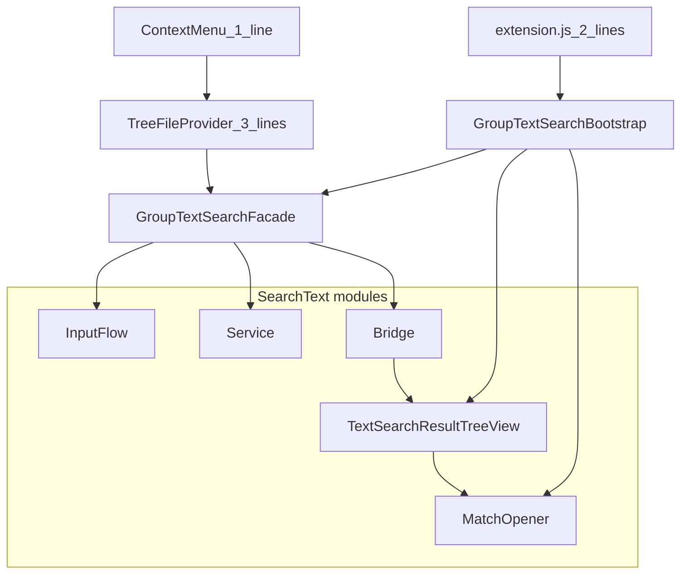

# Plan: Search text in group

## Quy trình làm việc

**Chỉ thực hiện 1 bước mỗi lần.** Sau mỗi bước: báo cáo ngắn → chờ bạn reply **OK** (hoặc feedback) → mới sang bước tiếp theo.

Bước hiện tại: **26 xong** — feature Search text in group hoàn tất.

---

## Nguyên tắc: nhúng nhẹ vào file chính

**Toàn bộ logic nằm trong `src/TreeFile/SearchText/`.** Các file “host” chỉ delegate — **không** copy logic `runGroupFilterSearch` (~30 dòng) như SearchFile hiện tại.

| File host | Cho phép thêm | Không được |
|-----------|---------------|------------|
| [`extension.js`](src/extension.js) | 1 `require` + **1 lời gọi** `activateGroupTextSearch(context, treeDataProvider)` | Tạo view, register command, input flow tại đây |
| [`TreeFileProvider.js`](src/TreeFile/TreeFileProvider.js) | `require` + `GroupTextSearchFacade.attach(this, context)` trong `run()` + method **1 dòng** delegate | `showInputBox`, `findTextInFiles`, build tree |
| [`TreeFileProviderOneLevel.js`](src/TreeFile/TreeFileProviderOneLevel.js) | Giống nested (2–3 dòng) | Duplicate logic |
| [`ContextMenu.js`](src/TreeFile/ContextMenu.js) | **1 dòng** trong `commandMap` | Handler dài |

### Entry points trong SearchText

| Class | Vai trò |
|-------|---------|
| **`GroupTextSearchBootstrap.js`** | Gọi từ `extension.js`: khởi tạo `TextSearchResultTreeView`, register `openTextSearchMatch`, tạo `Facade`, `attach` vào provider |
| **`GroupTextSearchFacade.js`** | API duy nhất cho provider: `attach(provider, context)`, `runFromGroupElement(groupElement)`, `dispose()` |



### Mẫu code host (mục tiêu sau khi xong)

**extension.js** (~2 dòng mới):

```javascript
const { activateGroupTextSearch } = require("./TreeFile/SearchText/GroupTextSearchBootstrap");
// trong activate(), sau khi có treeDataProvider:
activateGroupTextSearch(context, treeDataProvider);
```

**TreeFileProvider.js** (~3 dòng mới):

```javascript
const GroupTextSearchFacade = require("./SearchText/GroupTextSearchFacade");
// trong run(context):
GroupTextSearchFacade.attach(this, context);
// method delegate:
async runGroupTextSearch(groupElement) {
    return GroupTextSearchFacade.runFromProvider(this, groupElement);
}
```

**ContextMenu.js** (1 dòng trong `commandMap`):

```javascript
{ name: "fboFile.SearchTextInGroup", handler: async (group) => await this.treeDataProvider.runGroupTextSearch?.(group) },
```

> `GroupTextSearchFacade.attach` gắn `_groupTextSearchFacade` lên instance provider; `runFromProvider` đọc instance đó — provider không cần biết chi tiết.

---

## Mục tiêu chức năng

Tương đương:

```powershell
rg -i -F "impis" "<groupRoot>/App_Data/Controllers" -g "*.js" -g "*.xml" ... -n --column
```

UX: context menu group → nhập text → chọn extension → tab **Text Search** (file → dòng, highlight) → click mở editor đúng vị trí.

---

## Cấu trúc `src/TreeFile/SearchText`

| File | Vai trò |
|------|---------|
| `GroupTextSearchKinds.js` | Hằng số |
| `GroupTextSearchOptions.js` | Đọc settings |
| `GroupTextSearchScope.js` | Thư mục quét — reuse `GroupFileScanner.getScanStartDir` |
| `GroupTextSearchGroupResolver.js` | Parse `groupElement` → `{ groupRoot, groupName }` (logic tách khỏi provider) |
| `GroupTextSearchQuery.js` | `TextSearchQuery` |
| `GroupTextSearchResultModel.js` | Data shape |
| `GroupTextSearchAggregator.js` | Gom match + highlights |
| `GroupTextSearchService.js` | `findTextInFiles` + cancel + progress |
| `GroupTextSearchInputFlow.js` | InputBox + QuickPick |
| `GroupTextSearchBridge.js` | Publish → `TextSearchResultTreeView` |
| `GroupTextSearchMatchOpener.js` | Click dòng → editor |
| `TextSearchResultTreeView.js` | TreeDataProvider tab Text Search |
| **`GroupTextSearchFacade.js`** | Orchestrator — **cửa vào duy nhất** từ provider |
| **`GroupTextSearchBootstrap.js`** | Wire extension — **cửa vào duy nhất** từ `extension.js` |

**Không sửa** [`SearchFile/`](src/TreeFile/SearchFile) trừ reuse `GroupFileScanner` từ scope.

---

## Engine search

`vscode.workspace.findTextInFiles` (ripgrep nội bộ VS Code). Phạm vi: `App_Data/Controllers` nếu có.

---

## 26 bước thực hiện

### Phase A — Package & constants (01–05)

| Bước | File | Tiêu chí |
|------|------|----------|
| **01** | `GroupTextSearchKinds.js` | VIEW_ID, CMD_*, DEFAULT_EXTENSIONS, PANEL_CMD |
| **02** | `package.json` | settings `groupContentSearchExtensions`, `groupContentSearchCaseSensitive` |
| **03** | `package.json` | command `fboFile.SearchTextInGroup` |
| **04** | `package.json` | menu context group |
| **05** | `package.json` | view `fbo_text_search_result_view` + activationEvents |

### Phase B — Core (06–13)

| Bước | File | Tiêu chí |
|------|------|----------|
| **06** | `GroupTextSearchOptions.js` | `getExtensions()`, `isCaseSensitive()` |
| **07** | `GroupTextSearchScope.js` | `resolveSearchFolder(groupRoot)` |
| **08** | `GroupTextSearchGroupResolver.js` | `resolve(groupElement)` — tách logic validate group khỏi provider |
| **09** | `GroupTextSearchQuery.js` | `build(text, caseSensitive)` |
| **10** | `GroupTextSearchResultModel.js` | `createEmpty`, `addMatch`, `finalize` |
| **11** | `GroupTextSearchAggregator.js` | Map `TextSearchResult` → highlights |
| **12** | `GroupTextSearchService.js` | `search(...)` skeleton |
| **13** | `GroupTextSearchService.js` | progress + `CancellationTokenSource` |

### Phase C — UI tree (14–18)

| Bước | File | Tiêu chí |
|------|------|----------|
| **14** | `GroupTextSearchInputFlow.js` | `promptQuery` + `promptExtensions` |
| **15** | `TextSearchResultTreeView.js` | skeleton TreeDataProvider |
| **16** | `TextSearchResultTreeView.js` | root + file nodes |
| **17** | `TextSearchResultTreeView.js` | line nodes + `TreeItemLabel.highlights` |
| **18** | `GroupTextSearchMatchOpener.js` | `openMatch(uri, range)` |

### Phase D — Facade & wire nhẹ (19–25)

| Bước | File | Tiêu chí |
|------|------|----------|
| **19** | `GroupTextSearchBridge.js` | `publish(result, { reveal })` |
| **20** | `GroupTextSearchFacade.js` | `runFromGroupElement`: resolver → input → service → bridge |
| **21** | `GroupTextSearchBootstrap.js` | `activate(context, provider)`: view + commands + `Facade.attach` |
| **22** | `extension.js` | **≤2 dòng** gọi Bootstrap |
| **23** | `TreeFileProvider.js` | **≤3 dòng**: require + attach + delegate method |
| **24** | `TreeFileProviderOneLevel.js` | mirror bước 23 |
| **25** | `ContextMenu.js` | **1 dòng** commandMap |

### Phase E — Test (26)

| Bước | Tiêu chí |
|------|----------|
| **26** | UNC `impis`; click highlight; cancel; no match; host files không phình logic |

---

## Data shape

```javascript
{
  groupRoot, groupLabel, query,
  totalMatches, totalFiles,
  files: [{ relPath, absPath, matchCount, matches: [{ line, preview, highlights, range }] }]
}
```

---

## Phạm vi không làm phase 1

Regex, replace, persist history, watcher, `GroupTextSearchRipgrepRunner` (fallback).

---

## Bước tiếp theo

Reply **OK Bước 01** để tạo `GroupTextSearchKinds.js`.
