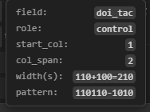

# Prompt Gemini — FEAT-08: Đối chiếu XML ↔ Preview (hover inspect + click reveal `<item>`)

Copy khối **Prompt** cho Gemini (`@src/PreviewForm`).

Thay thế mục đích “Copy for Agent” (đã hủy FEAT-06/07): Developer **hover/click trên Preview** → biết ngay field/cột → **nhảy tới dòng `<item>`** trong editor.

Tham chiếu host sẵn có: `XmlFlatPreviewPanel` / `CheckingErrorPanel` (`showTextDocument` + `revealRange`).

---

## Prompt

```
Thêm Preview Form: đối chiếu nhanh XML ↔ Preview.

═══════════════════════════════════════
### A) Hover — hiện thông tin cột / field
═══════════════════════════════════════

Khi hover **ô slot** (label / control / description / `%l` / empty gap tùy chọn):

Hiện tooltip (custom, sticky gần ô, dark theme) gồm tối thiểu:

| Dòng | Ví dụ |
|------|--------|
| field | `con_in_mm_ngang` |
| role | `control` \| `label` \| `description` \| `lookup_name` |
| start_col | `0` (0-based) — có thể ghi thêm 1-based `cột XML #1` |
| col_span | `1` (hoặc `2` nếu pattern `10…`) |
| width(s) | `100` hoặc `100+30=130` nếu span nhiều cột — lấy từ `row.column_widths[start_col .. start_col+span)` |
| pattern | rút gọn `row.pattern` (vd `11-11-11-1-11--`) |

Empty cell `-` (optional MVP+): hover hiện `gap / empty`, `start_col`, `width` (vd 30) — rất hữu ích debug gap dính.

Implement gợi ý:
- `title=` native **không đủ** (nhiều dòng) → div `.inspect-tooltip` giống guide-tooltip.
- Data gắn trên `.form-cell` / `.form-cell-empty`: `data-field`, `data-start-col`, … hoặc truyền props + state hover.
- `pointer-events` không chặn Tab focus controls.

═══════════════════════════════════════
### B) Click — reveal dòng `<item>` trong editor
═══════════════════════════════════════

1. Click ô slot (hoặc Ctrl+Click nếu sợ conflict — **mặc định click** OK; double-click cũng được nếu cần tránh focus input).
2. Webview `postMessage`:
```js
{
  type: 'revealViewItem',
  raw_item_value: row.raw_item_value,  // đủ chuỗi sau parse, vd '11-11-11-1-11--: [con_in_mm_ngang], …'
  field: 'con_in_mm_ngang',             // optional highlight phụ
  start_col: 0
}
```
3. **Host `PreviewFormPanel`** (file `_uri` đang preview):
   - `showTextDocument(this._uri)` (cột editor, không che mất preview nếu có thể).
   - Tìm trong **document text** (buffer đang mở ưu tiên) vị trí `raw_item_value` hoặc substring ổn định:
     - Ưu tiên match full `raw_item_value` trong `value="..."`.
     - Fallback: match pattern + field name trên cùng dòng `<item`.
   - `editor.selection` + `revealRange(..., InCenterIfOutsideViewport)`.
   - Không tìm thấy → `showWarningMessage` rõ (entity/DTD khác dòng flat — gợi ý Search thủ công).

Lưu ý flatten: `raw_item_value` lấy từ XML đã expand; file nguồn có thể xuống dòng / `&Entity;`.  
Chiến lược tìm:
1. Exact `raw_item_value` trong doc.
2. Nếu fail: tìm `pattern` + `[field]` gần nhau trên 1–2 dòng.
3. Vẫn fail: warning.

Optional (nice): parser gắn `source_line` khi parse từ flat — MVP **không bắt buộc**.

═══════════════════════════════════════
### C) Model / props cần sẵn
═══════════════════════════════════════

Mỗi `ViewRow` đã có (hoặc bổ sung nếu thiếu):
- `pattern`, `raw_item_value`, `column_widths`, `cells[].start_col`, `col_span`, `slot`

Truyền xuống `FormRow` / cell khi render — **không** cần Copy clipboard.

═══════════════════════════════════════
### D) Không làm
═══════════════════════════════════════

- Không làm lại Copy for Agent / copy HTML.
- Không đổi layout columns/pattern.
- Không bắt buộc i18n.

### Files
- `media/src/main.js` — hover tooltip; click → postMessage
- `media/src/previewForm.css` — `.inspect-tooltip`, cursor `help`/`pointer` trên cell
- `PreviewFormPanel.js` — `revealViewItem` + revealRange (học từ XmlFlatPreviewPanel)
- Rebuild: `npm run build:preview-form`

### Done
- [ ] Hover `con_in_mm_ngang`: thấy name + start_col + width (+ pattern)
- [ ] Hover gap `-` (nếu làm): thấy width 30
- [ ] Click ô → editor nhảy tới `<item value="…11-11-11-1-11--…">` (hoặc warning nếu không match)
- [ ] Không regress Anchor/Split toolbar
```

---

## UX nhớ

```
Hover  →  đọc nhanh (name / cột / px)
Click  →  nhảy XML <item>
Skill  →  Developer tự sửa pattern/columns theo fbo-design-view-field
```
