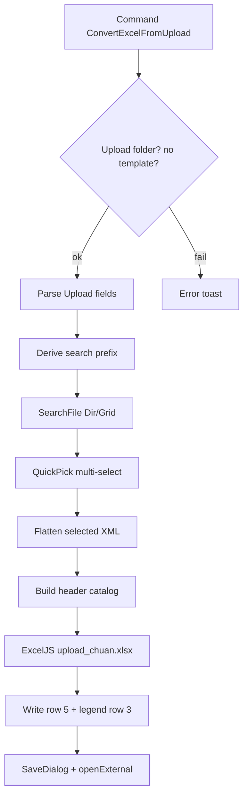

# Convert Excel From Upload — Tài liệu triển khai cho Gemini

Bộ tài liệu mô tả **đầy đủ** tính năng **ConvertExcelFromUpload** của extension `fbo-autocomplete`: từ file Upload XML **phiên bản cũ** (không có thẻ `<template>`), lấy danh sách field + cột Excel, lookup file Dir/Grid qua SearchFile, lấy `header/@v`, rồi xuất file Excel theo mẫu `upload_chuan.xlsx` (header dòng 5, `*` đỏ cho field bắt buộc).

> **Phạm vi docs:** đặc tả + kế hoạch implement. Agent đọc theo thứ tự bên dưới rồi code. Không hỏi lại các quyết định đã chốt.

---

## Cách đọc (bắt buộc theo thứ tự)

| # | File | Nội dung |
|---|------|----------|
| 1 | [01-requirements.md](./01-requirements.md) | Mục tiêu, user stories, non-goals, Done |
| 2 | [02-domain-rules.md](./02-domain-rules.md) | Prefix tên file, parse Upload, resolve header, `allowNulls`, cột Excel |
| 3 | [03-parser-spec.md](./03-parser-spec.md) | Contract parser / API thuần (testable) |
| 4 | [04-search-and-ui.md](./04-search-and-ui.md) | SearchFile + QuickPick multi-select |
| 5 | [05-excel-export.md](./05-excel-export.md) | ExcelJS + `upload_chuan.xlsx`, rich text `*` |
| 6 | [06-extension-integration.md](./06-extension-integration.md) | Folder riêng, command, `extension.js`, pack VSIX |
| 7 | [07-implementation-plan.md](./07-implementation-plan.md) | Task checklist tuần tự (TDD) |
| 8 | [08-acceptance-checklist.md](./08-acceptance-checklist.md) | Nghiệm thu ARTran (pass) / SVTran (chặn) |

---

## Quyết định đã chốt

| Hạng mục | Chốt |
|----------|------|
| Command id | `fbo-autocomplete.ConvertExcelFromUpload` |
| Title | `FBO: Convert Excel From Upload` |
| Folder code | **`src/ConvertExcelFromUpload/`** — tách hẳn khỏi `src/ConvertToExcel/` |
| `extension.js` | Chỉ `require` + `registerConvertExcelFromUpload(context, deps)` (~2 dòng) |
| Phạm vi file | Active editor trong folder `Templates/Upload` |
| Phiên bản mới | Có thẻ `<template>` → **chặn** (vd SVTran FBI) |
| Phiên bản cũ | Không `<template>`, field có `column="A"`… (vd ARTran Gate) |
| Template Excel | [`src/Database/upload_chuan.xlsx`](../../Database/upload_chuan.xlsx) — header **dòng 5** |
| UI chọn file | `vscode.window.showQuickPick(..., { canPickMany: true })` |
| Suffix → prefix | Basename kết thúc `Tran` \| `Detail` \| `Master` (case-insensitive) → **2 ký tự đầu**; ngược lại lấy **toàn bộ** tên |
| Search | `GroupFileIndexService.search` (SearchFile LevelDB index) — **không** query SQL app |
| Filter kết quả | Chỉ `Controllers/Dir` và `Controllers/Grid` |
| Header | `header/@v` (tiếng Việt) |
| Vị trí cột | Theo `column` của Upload field — **không** dồn sequential nếu skip cột |
| Bắt buộc | `allowNulls="false"` → prefix `*` màu đỏ + legend dòng 3 |
| Thiếu header | Fallback = `name` field |
| Trùng field | Thứ tự user chọn; header non-empty **đầu tiên thắng** |

---

## Nguyên tắc kiến trúc (bắt buộc)

1. **Folder riêng `src/ConvertExcelFromUpload/`** — command, parser, excel, tests.
2. **`extension.js` chỉ ~2 dòng** — `require` + `registerConvertExcelFromUpload(...)`.
3. **Không trộn** logic vào `ConvertToExcel/`, `TreeFile/`, `FormulaPreview/`, `RetrieveFlow/`.
4. **Tận dụng** `AppDataPathHelper`, `GroupFileIndexService`, `XmlEntityExpander` / `entityResolver`, `ExcelJS`, `resolveBundledDatabaseRoot`.

---

## Pipeline

```
Command (active Upload XML)
  → Guard: Upload folder? + không có <template>?
  → Parse Upload fields (name, column, allowNulls)
  → Derive search prefix từ tên file
  → GroupFileIndexService.search → filter Dir/Grid
  → QuickPick multi-select
  → Flatten Dir/Grid đã chọn → catalog header.v
  → Merge Upload fields + headers
  → ExcelJS load upload_chuan.xlsx → ghi dòng 5 (+ legend dòng 3)
  → SaveDialog → openExternal
```



---

## Fixture vàng

| Case | Path (mạng / project) | Kỳ vọng |
|------|------------------------|---------|
| Legacy pass | `Gate-FBOR2\...\Templates\Upload\ARTran.xml` | Xuất Excel header đúng cột + `*` đỏ |
| Template block | `SHOWA\FBISP242\...\Templates\Upload\SVTran.xml` | Chặn, không xuất |
| Exact name | Upload `zcamdm.xml` | Search full name, không cắt 2 ký tự |

Header nguồn mẫu: `Dir/ARTran.xml`, `Grid/ARDetail.xml`.
