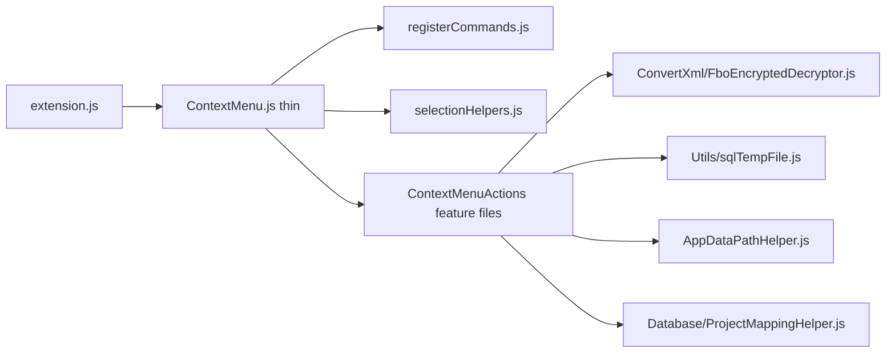

# 01 — Kiến trúc tách `ContextMenuActions/`

## 1. Sơ đồ phụ thuộc



- Entry public **giữ nguyên**: `src/TreeFile/ContextMenu.js` → `module.exports = ContextMenuHandler`.
- `extension.js` tiếp tục `require("./TreeFile/ContextMenu")`.

## 2. Folder mới

Tạo: `src/TreeFile/ContextMenuActions/`

| File mới | Nguồn trong `ContextMenu.js` hiện tại | Notes |
|----------|----------------------------------------|--------|
| `selectionHelpers.js` | `getPathsSelect`, `getSelectedTargets` | Dùng `this.treeView`, `vscode.window.activeTextEditor` |
| `registerCommands.js` | `commandMap` + vòng `registerCommand` | Export `function registerCommands(handler)` |
| `GenerateCopyFile.js` | `#region Generate Copy File` | Gồm `parseRenameInput`, `generateCopyForFiles`, `GenerateCopyFile` |
| `PasteFilesToGroup.js` | `#region Paste Files To Group` | PowerShell clipboard FileDropList |
| `OpenRevealFolder.js` | `#region Open Reveal Folder` | Win `explorer /select` / mac `open -R` |
| `CopyPath.js` | `#region Copy Path` | |
| `RenameFile.js` | `#region Rename File` | `renameFileCommand` |
| `CopyFile.js` | `#region Copy File` | PS SetFileDropList temp `.ps1` |
| `CopyNameOfFile.js` | `#region Copy Name of File` | `copyNameOfFile`, `copyNameOfFileNoEx` + setting `ExtFileNameCopy` |
| `OpenWebConfig.js` | `#region Open Web.config` | |
| `ConfigProjectRoot.js` | `#region Config Project Root` | `ProjectMappingHelper.setMapping` |
| `ExpandAll.js` | `#region Expand All` | `_fboTreeLabel`, `_expandTreeNodeRecursive`, `expandAll` |
| `FixWebConfig.js` | `#region Fix Web.config` | touch Web.config (ghi space rồi restore) |
| `DeleteStruct.js` | `#region Xóa struct` | Xóa file trong Structure App/Dir/Filter/Grid/Sys |
| `NewSqlTemp.js` | `#region New .sql Temp` + On Workspace | `createSqlTempFile` / `resolveSqlTempFolder` / `isAntigravityIde` |
| `ConvertXmlFromF.js` | `#region Convert XML from .f` | `require("../ConvertXml/FboEncryptedDecryptor")` |
| `DeleteFile.js` | `#region Delete File` | |

### Giữ nguyên (không chuyển vào `ContextMenuActions`)

| Path | Lý do |
|------|--------|
| `src/TreeFile/ConvertXml/FboEncryptedDecryptor.js` | Crypto thuần, đã có test |
| `src/TreeFile/ConvertXml/tests/*` | Unit decrypt |
| `src/Utils/sqlTempFile.js` | Shared util |
| `src/TreeFile/AppDataPathHelper.js` | Shared helper |

`ConvertXmlFromF.js` chỉ chứa **UI/flow** Convert (resolve URI, chặn ghi đè, đọc setting, gọi `decryptFContent`, ghi file, mở editor).

## 3. Pattern gắn method (bắt buộc)

### 3.1. Action file — method dùng `this`

Giống method class cũ. **Không** đổi sang pure function nhận deps nếu không cần — ưu tiên cut-paste body + `this.*`.

```js
// ContextMenuActions/CopyPath.js
const vscode = require("vscode");

async function CopyPath() {
    const paths = this.getPathsSelect();
    if (!paths || paths.length === 0) return;
    await vscode.env.clipboard.writeText(paths.join("\n"));
}

module.exports = { CopyPath };
```

Nhiều method trong một file:

```js
module.exports = {
    copyFilesToClipboard,
    copyFile
};
```

### 3.2. `registerCommands.js`

```js
function registerCommands(handler) {
    const commandMap = [
        { name: "fboFile.openRevealFolder", handler: handler.openRevealFolder.bind(handler) },
        // ... GIỮ ĐỦ tên command như ContextMenu.js hiện tại
        // Khớp đúng kiểu bind hiện có:
        // - một số: () => handler.copyFile()
        // - một số: async (group) => await handler.fixWebConfig(group)
        // - ConvertXml: async (itemOrUri) => await handler.convertXmlFromF(itemOrUri)
    ];
    for (const { name, handler: h } of commandMap) {
        handler.context.subscriptions.push(
            vscode.commands.registerCommand(name, h)
        );
    }
}

module.exports = registerCommands;
```

**Bắt buộc:** copy nguyên danh sách `commandMap` từ ctor hiện tại — không đổi `name`, không bỏ command.

### 3.3. Assign prototype **một lần** ở top-level

**Cấm** `Object.assign(ContextMenuHandler.prototype, …)` bên trong `constructor` (mỗi `new` gán lại).

```js
// ContextMenu.js (mỏng)
const vscode = require("vscode");
const app_dataChecker = require("./AppDataPathHelper");
const registerCommands = require("./ContextMenuActions/registerCommands");
const selectionHelpers = require("./ContextMenuActions/selectionHelpers");
const GenerateCopyFile = require("./ContextMenuActions/GenerateCopyFile");
// ... require đủ các action modules

class ContextMenuHandler {
    constructor(context, treeDataProvider) {
        this.context = context;
        this.treeDataProvider = treeDataProvider;
        this.treeView = treeDataProvider.treeView;
        this.treeData = treeDataProvider.treeData;
        this.app_dataChecker = new app_dataChecker();
        this.config = vscode.workspace.getConfiguration("fbo-autocomplete");

        registerCommands(this);

        if (this.treeView && typeof this.treeView.onDidChangeSelection === "function") {
            this.treeView.onDidChangeSelection((e) => {
                const isFileSelected =
                    e.selection.length > 0 &&
                    e.selection.every(
                        (item) => item.contextValue === "file" || item.contextValue === "file_f"
                    );
                vscode.commands.executeCommand("setContext", "fboViewFileSelected", isFileSelected);
            });
        }
    }
}

Object.assign(
    ContextMenuHandler.prototype,
    selectionHelpers,
    GenerateCopyFile,
    /* ...mọi action module còn lại... */
);

module.exports = ContextMenuHandler;
```

Sau assign, instance có `this.getPathsSelect`, `this.convertXmlFromF`, … như trước.

## 4. Dependency mỗi module được phép `require`

| Module | Được require |
|--------|----------------|
| Hầu hết | `vscode`, `path`, `fs` khi cần |
| `PasteFilesToGroup` / `CopyFile` | `child_process`, `os` (như hiện tại) |
| `NewSqlTemp` | `../Utils/sqlTempFile` |
| `ConvertXmlFromF` | `../ConvertXml/FboEncryptedDecryptor` |
| `ConfigProjectRoot` | `../Database/ProjectMappingHelper` |
| Dùng tree / paste | `this.app_dataChecker`, `this.treeDataProvider`, `this.config`, `this.treeView` |

Không tạo circular require: `ContextMenuActions/*` **không** `require("../ContextMenu")`.

## 5. Kích thước mục tiêu `ContextMenu.js`

Sau refactor: chủ yếu require + class ctor + `Object.assign` + export — **&lt; ~120 dòng**.  
Logic nghiệp vụ nằm hết trong `ContextMenuActions/`.
